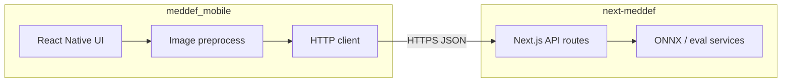
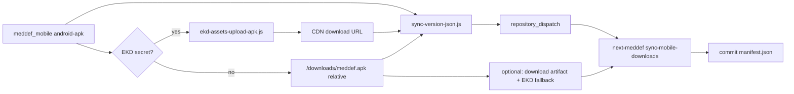

# MedDef Mobile — Technical Roadmap

Living documentation for the **meddef_mobile** repository: stack, layout, builds, versioning, web integration, and CI. Use this as the source of truth while the team expands a full project write-up.

**Last verified against repo:** May 2026.

---

## Production URLs

Canonical host for **web UI**, **REST API** (`/api/*`), and **static downloads**. Use **no trailing slash** on origins; join paths with a leading `/` (e.g. `${origin}/api/infer`).

| Role | URL |
|------|-----|
| Web app (dashboard) | `https://meddef.ekddigital.com` |
| API base (same host) | `https://meddef.ekddigital.com` |
| Downloads hub | `https://meddef.ekddigital.com/downloads` |
| Android APK | `https://meddef.ekddigital.com/downloads/meddef.apk` |
| Release manifest | `https://meddef.ekddigital.com/downloads/manifest.json` |
| Legacy Android JSON | `https://meddef.ekddigital.com/downloads/version.json` |
| Manifest API | `https://meddef.ekddigital.com/api/downloads-manifest` |
| Legacy mobile-version API | `https://meddef.ekddigital.com/api/mobile-version` |

**Code defaults:** mobile `src/config/api.ts` → `API_BASE_URL`; web `.env.example` → `NEXT_PUBLIC_URL`; sync script `scripts/sync-version-json.js` documents the same origin. Manifest `url` / `apkUrl` fields stay **site-relative** (`/downloads/...`); the app resolves them against the configured API base.

**Local / lab:** override API base in the mobile app (AsyncStorage) or set `NEXT_PUBLIC_URL=http://localhost:3000` for Next.js dev. Android cleartext is enabled for HTTP lab backends (`expo-build-properties`).

---

## Table of contents

0. [Production URLs](#production-urls)
1. [Stack overview](#1-stack-overview)
2. [App structure](#2-app-structure)
3. [Android build (`meddef.apk`)](#3-android-build-meddefapk)
4. [Other platforms](#4-other-platforms)
5. [Versioning and sync](#5-versioning-and-sync)
6. [Web integration (next-meddef)](#6-web-integration-next-meddef)
7. [CI/CD](#7-cicd)
8. [Icons and branding](#8-icons-and-branding)
9. [Local development commands](#9-local-development-commands)
10. [Future work](#10-future-work)
11. [Known gaps and TBD](#11-known-gaps-and-tbd)

---

## 1. Stack overview

### React Native, Expo, and workflow

This project is **not Flutter**. It is **Expo + React Native** with **TypeScript**.

| Layer | Choice | Notes |
|--------|--------|--------|
| Framework | **React Native** `0.81.5` | Native UI; ONNX runs on the server, not on-device |
| Tooling | **Expo SDK** `~54.0.33` | Managed config in `app.json`; dev via `expo start` |
| Workflow | **Prebuild / development build** (not Expo Go–only) | `android/` and `ios/` exist locally after prebuild; `package.json` uses `expo run:android` / `expo run:ios` |
| Language | **TypeScript** `~5.9.2` | `npm run lint` → `tsc --noEmit` |
| React | `19.1.0` | Matches current Expo 54 stack |
| New Architecture | Enabled | `app.json` → `expo.newArchEnabled: true` |

**Expo Go vs bare:** The app targets a **custom dev/production build** (native modules, cleartext HTTP for lab APIs, image picker, etc.). Day-to-day dev can use Metro (`expo start`) plus **`npx expo run:android`** to install a dev build on a device or emulator. Native projects are generated by Expo prebuild; they are listed in `.gitignore` and are **not committed** (see [§11](#11-known-gaps-and-tbd)).

**Optional cloud builds:** [`eas.json`](../eas.json) defines Android **APK** profiles (`preview`, `production`). [`BUILD.md`](../BUILD.md) documents EAS cloud/local builds as an alternative to Gradle on the machine.

### Key dependencies (`package.json`)

| Package | Role |
|---------|------|
| `@react-navigation/native`, `@react-navigation/bottom-tabs` | Bottom-tab navigation |
| `react-native-screens`, `react-native-safe-area-context`, `react-native-gesture-handler` | Navigation and layout primitives |
| `@react-native-async-storage/async-storage` | Persist API base URL and update-dismiss state |
| `expo-splash-screen`, `expo-font`, `expo-status-bar` | Splash and UI chrome |
| `expo-image-picker`, `expo-image-manipulator`, `expo-file-system` | Imaging workflow for inference |
| `expo-build-properties` | Android `usesCleartextTraffic` for local/lab backends |
| `jpeg-js`, `base64-js` | Client-side preprocessing aligned with the web app |
| `@expo/vector-icons` | Tab bar icons (Ionicons) |
| `babel-preset-expo`, `babel-plugin-module-resolver` | Bundling and `@/` path alias |

Path alias: `@/*` → `src/*` (see `tsconfig.json` and `babel.config.js`).

### Backend coupling

The mobile client is a **thin HTTP client** for **[next-meddef](../next-meddef)**. Default API origin: `https://meddef.ekddigital.com` (`src/config/api.ts`). Inference and LLMShield call the same REST routes as the web dashboard.



---

## 2. App structure

### Entry and root

| File | Responsibility |
|------|----------------|
| [`index.ts`](../index.ts) | Registers root component; keeps splash visible until `App` hides it |
| [`App.tsx`](../App.tsx) | `GestureHandlerRootView` → `SafeAreaProvider` → `ApiProvider` → `AppRoot` (update check + navigation) |

### `src/` layout

```
src/
├── api/client.ts          # HTTP helpers against configurable base URL
├── config/api.ts          # API_BASE_URL
├── config/app.ts          # APP metadata, AsyncStorage keys
├── context/ApiContext.tsx # baseUrl state + persistence
├── navigation/MainTabs.tsx
├── screens/               # Overview, Inference, LLMShield, Datasets, Models, Results
├── hooks/useAppUpdate.ts
├── lib/                   # appUpdate, infer, preprocess, format
├── data/                  # datasets, model variants, samples
├── components/            # layout, UI primitives, ScreenHeader
└── theme/                 # colors, tokens, shared styles
```

### Navigation

[`src/navigation/MainTabs.tsx`](../src/navigation/MainTabs.tsx) defines a **bottom tab navigator** with six screens, mirroring the web information architecture:

- **Overview** — branding and stats  
- **Inference** — imaging / ONNX via `/api/infer`  
- **LLMShield** — text inference via `/api/infer-text`  
- **Datasets**, **Models**, **Results** — parity with web sections  

Dark theme colors align with the web sidebar palette (`src/theme/colors.ts`).

### State management

There is **no global store** (no Redux/Zustand). State is localized:

- **`ApiContext`** — API base URL (default + user override in AsyncStorage)  
- **`useAppUpdateCheck`** — one-shot remote version check after `ApiContext` is ready  
- **Screen-local state** — forms, picks, inference results  

---

## 3. Android build (`meddef.apk`)

### How the APK is produced

1. **Install JS dependencies:** `npm ci` or `npm install`  
2. **Ensure native project exists:** `npx expo prebuild --platform android` (or `npx expo run:android`, which prebuilds as needed). The `android/` directory is **gitignored** but required for Gradle.  
3. **Build with Gradle:**

| npm script | Gradle task | Typical use |
|------------|-------------|-------------|
| `npm run android:apk` | `assembleDebug` | Local sideload / dev |
| `npm run android:apk:release` | `assembleRelease` | CI and release-like artifacts |

Commands run from repo root: `cd android && ./gradlew assembleDebug|assembleRelease`.

### Output paths and renaming

Gradle writes APKs under variant-specific folders. Both debug and release outputs are renamed to **`meddef.apk`** in [`android/app/build.gradle`](../android/app/build.gradle):

```gradle
android.applicationVariants.configureEach { variant ->
    variant.outputs.configureEach {
        outputFileName = "meddef.apk"
    }
}
```

| Variant | Path (after build) |
|---------|-------------------|
| Debug | `android/app/build/outputs/apk/debug/meddef.apk` |
| Release | `android/app/build/outputs/apk/release/meddef.apk` |

`applicationId` / package: `com.anonymous.meddef_mobile` (from `app.json`).

### Signing (current state)

Release builds currently use the **debug keystore** in `android/app/build.gradle` (`signingConfig signingConfigs.debug` for release). **Production signing is not configured** — treat release APKs as internal/sideload until a release keystore and CI secrets exist.

### Publishing to the website

After building, copy the release APK to the Next.js static downloads folder, for example:

`next-meddef/public/downloads/meddef.apk`

Then run version sync (§5) so `manifest.json` and `version.json` match `app.json`.

---

## 4. Other platforms

Status is defined in code ([`scripts/sync-version-json.js`](sync-version-json.js)) and mirrored on the web ([`next-meddef/public/downloads/manifest.json`](../../next-meddef/public/downloads/manifest.json)).

| Platform | Repo / config | Download hub status | Notes |
|----------|---------------|---------------------|--------|
| **Android** | `android/` (prebuild), Gradle APK | `available` | Only platform with a hosted APK today |
| **iOS** | `ios/` (prebuild), `app.json` iOS block | `external` | Bundle ID `com.anonymous.meddef-mobile`; TestFlight/App Store — **no direct IPA on `/downloads`** |
| **macOS** | Not in mobile repo | `coming_soon` | Placeholder `meddef-macos.dmg` in manifest |
| **Windows** | Not in mobile repo | `coming_soon` | Placeholder `meddef-setup.exe` in manifest |
| **Linux** | Not in mobile repo | `coming_soon` | Web hub shows “Coming soon for Linux”; no desktop client in this repo |

**iOS in repo:** `ios/` exists locally when prebuild has been run; it is **gitignored** like `android/`. `npm run ios` / `expo run:ios` is available for simulator/device dev — **distribution pipeline not implemented**.

**Windows / macOS desktop:** Not part of `meddef_mobile`; manifest entries are placeholders for future CI artifacts.

---

## 5. Versioning and sync

### Source of truth

- **Semantic version:** `app.json` → `expo.version` (e.g. `1.0.0`)  
- **Android `versionCode`:** optional `expo.android.versionCode` in `app.json`; if omitted, [`sync-version-json.js`](sync-version-json.js) derives it by joining version digits (`1.0.0` → `100`)

### Sync script

```bash
npm run sync:version
# or
node scripts/sync-version-json.js [path-to-next-meddef-or-dist]
```

**Default target:** `../next-meddef/public/downloads/`

**Writes:**

| File | Purpose |
|------|---------|
| `manifest.json` | Multi-platform release manifest (Android + placeholders) |
| `version.json` | Legacy Android-only shape for older clients |

The script **merges** an existing `manifest.json` when present (preserves non-Android platform fields; refreshes Android version fields and top-level release metadata).

**CI usage:** [`.github/workflows/android-apk.yml`](../.github/workflows/android-apk.yml) runs `sync-version-json.js` with `ANDROID_*` env vars after optional ekd-assets upload; JSON is uploaded as an artifact and mirrored to `next-meddef` when dispatch secrets are configured.

### In-app update checks

[`src/lib/appUpdate.ts`](../src/lib/appUpdate.ts) fetches remote version info from the configured API base, trying in order:

1. `/downloads/manifest.json`  
2. `/api/downloads-manifest`  
3. `/downloads/version.json`  
4. `/api/mobile-version`  

[`src/hooks/useAppUpdate.ts`](../src/hooks/useAppUpdate.ts) compares remote semver to `expo-constants` local version and prompts to open the APK URL via `Linking` when newer. Dismissal is stored per remote version in AsyncStorage.

---

## 6. Web integration (next-meddef)

### Downloads hub

- **Page:** `next-meddef/src/app/(dashboard)/downloads/page.tsx`  
- **UI:** `DownloadsHub` — platform tabs, status badges, download CTAs  
- **Static manifest:** `public/downloads/manifest.json`  
- **Static APK:** `public/downloads/meddef.apk` (when published; often **not** committed if large — see [`BUILD.md`](../BUILD.md))

### OS detection

[`next-meddef/src/lib/detect-platform.ts`](../../next-meddef/src/lib/detect-platform.ts) parses `User-Agent` (and `navigator.platform` on the client) into `android` | `ios` | `macos` | `windows` | `linux` | `unknown`.

- **Server:** `headers().get("user-agent")` on the downloads page for initial tab  
- **Client:** `DownloadsHub` refines detection (e.g. iPadOS reporting as Macintosh) and selects the matching tab when that platform exists in the manifest  

Linux visitors see explicit **“coming soon”** copy when Linux is detected.

### API mirrors for mobile

| Route | Returns |
|-------|---------|
| `GET /api/downloads-manifest` | Full `manifest.json` JSON |
| `GET /api/mobile-version` | Legacy `{ version, versionCode, apkUrl, releaseNotes }` from Android section |

### Artifact URLs

Android entries use **site-relative** paths (e.g. `/downloads/meddef.apk`) or **absolute** ekd-assets CDN URLs after CI upload. The mobile app resolves relative paths against the user’s API base ([`appUpdate.ts`](../src/lib/appUpdate.ts)); absolute URLs are used as-is.

### Related workflow (sibling repo)

[`next-meddef/.github/workflows/sync-mobile-downloads.yml`](../../next-meddef/.github/workflows/sync-mobile-downloads.yml) listens for `repository_dispatch` (`mobile-apk-published`) from mobile CI and commits updated `manifest.json` / `version.json` to `public/downloads/`. APK binaries are hosted on **EKD Digital Assets** when configured; otherwise the workflow can download the GitHub Actions artifact and optionally commit a small APK to `public/downloads/`.

---

## 7. CI/CD

### Architecture (connected flow)

**Hybrid (Option C):** release APK on **EKD Digital Assets CDN** (same service as ONNX uploads in `next-meddef/src/lib/ekd-assets.ts`); **manifest + legacy `version.json`** live in `next-meddef/public/downloads/` and are updated by automation.



| Step | Repo | What happens |
|------|------|----------------|
| 1 | `meddef_mobile` | Build release `meddef.apk`, compute `sha256` / `sizeBytes` |
| 2 | `meddef_mobile` | Upload APK to ekd-assets (if `EKD_DIGITAL_ASSETS_API_SECRET` set) |
| 3 | `meddef_mobile` | `sync-version-json.js` → `dist/downloads/*.json` with CDN or site-relative URL |
| 4 | `meddef_mobile` | `repository_dispatch` → `next-meddef` (if dispatch secrets set) |
| 5 | `next-meddef` | Commit `public/downloads/manifest.json` + `version.json`; deploy site as usual |

**Android `url` / `apkUrl`:** May be an **absolute** ekd-assets URL or site-relative `/downloads/meddef.apk`. [`appUpdate.ts`](../src/lib/appUpdate.ts) resolves both.

### meddef_mobile — `Android APK` workflow

**File:** [`.github/workflows/android-apk.yml`](../.github/workflows/android-apk.yml)

| Trigger | `push` to `main` / `master`, all `pull_request`, `workflow_dispatch` |
|---------|------------------------------------------------------------------------|
| Runner | `ubuntu-latest` |
| Node | 20 (`npm ci`) |
| Java | Temurin 17 |
| Build | `./gradlew assembleRelease` in `android/` |
| Artifacts | `meddef-apk` → `android/app/build/outputs/apk/release/meddef.apk`; `downloads-manifest` → `dist/downloads/*.json` |
| Publish (main only) | Optional ekd-assets upload + dispatch to `next-meddef` |

**GitHub secrets (`meddef_mobile` repo):**

| Secret | Purpose |
|--------|---------|
| `EKD_DIGITAL_ASSETS_API_SECRET` | Bearer (`sk_…`) for APK upload to assets.andgroupco.com |
| `EKD_DIGITAL_ASSETS_API_URL` | Optional API base (defaults to production) |
| `NEXT_MEDDEF_DISPATCH_TOKEN` | PAT with `repo` + `workflow` on `next-meddef` |
| `NEXT_MEDDEF_REPO` | e.g. `your-org/next-meddef` |

**Scripts:** [`scripts/ekd-assets-upload-apk.js`](ekd-assets-upload-apk.js) (chunked upload ≥ 10 MB); [`scripts/sync-version-json.js`](sync-version-json.js) reads `ANDROID_APK_URL`, `ANDROID_SIZE_BYTES`, `ANDROID_SHA256`.

**PR builds:** Upload artifacts only — no ekd-assets upload, no cross-repo dispatch.

### next-meddef — `Sync mobile downloads` workflow

**File:** [`next-meddef/.github/workflows/sync-mobile-downloads.yml`](../../next-meddef/.github/workflows/sync-mobile-downloads.yml)

| Trigger | `repository_dispatch` (`mobile-apk-published`), `workflow_dispatch` |
|---------|---------------------------------------------------------------------|
| Writes | `public/downloads/manifest.json`, `version.json` |
| Optional | Download `meddef-apk` artifact from mobile run; ekd-assets upload if mobile CI skipped CDN |
| Optional commit | `public/downloads/meddef.apk` when `commit_apk: true` and file &lt; ~50 MB |

**GitHub secrets (`next-meddef` repo):**

| Secret | Purpose |
|--------|---------|
| `MOBILE_REPO` | e.g. `your-org/meddef_mobile` |
| `MOBILE_REPO_TOKEN` | PAT with `actions:read` + `contents:read` on mobile repo |
| `EKD_DIGITAL_ASSETS_API_SECRET` | Fallback CDN upload when mobile job did not upload |

**Manual fallback:** Run `workflow_dispatch` with `apk_artifact_run_id` from a green `Android APK` run (Actions → run id in URL).

**Still manual:** Deploying the Next.js site (Vercel/VPS) after manifest commit; SSH lab host **`enoch@192.168.252.237`** is not wired into Actions.

### EAS (optional)

Documented in [`BUILD.md`](../BUILD.md): `eas build -p android --profile preview` produces APKs on Expo’s infrastructure; artifacts must still be placed under `public/downloads/` for the website.

---

## 8. Icons and branding

| Asset | Path | Usage |
|-------|------|--------|
| App icon | `assets/ujn_logo.png` | `app.json` → `expo.icon` |
| Android adaptive icon | Same file | `expo.android.adaptiveIcon.foregroundImage`, white background |
| Splash | Same file | `expo.splash` + `expo-splash-screen` plugin (`imageWidth: 200`) |
| Web favicon | `assets/favicon.png` | Expo web only |
| In-app hero | `assets/ujn_logo.png` | e.g. Overview screen |

Expo prebuild regenerates native launcher/mipmap assets from `app.json`. After changing the logo, run prebuild or rebuild native projects.

---

## 9. Local development commands

| Goal | Command |
|------|---------|
| Install dependencies | `cd meddef_mobile && npm install` |
| Start Metro | `npm start` or `npx expo start` |
| Typecheck | `npm run lint` or `npm run verify` |
| Run on Android (dev build + install) | `npm run android:install` or `npx expo run:android` |
| Run on iOS simulator/device | `npm run ios` or `npx expo run:ios` |
| Build debug APK | `npm run android:apk` |
| Build release APK | `npm run android:apk:release` |
| Sync web manifests | `npm run sync:version` |
| Reinstall on USB device | Ensure USB debugging; `adb devices`; then `npx expo run:android` |

**First-time native setup:** If `android/` or `ios/` is missing, run `npx expo prebuild` (or `expo run:*`, which triggers prebuild).

**API reachability:** Physical devices must reach the configured API host (production or lab). Cleartext HTTP is allowed on Android via `expo-build-properties` for local networking.

See also [`scripts/README.txt`](README.txt) for a short script index.

---

## 10. Future work

Placeholders for the full project write-up — **not implemented** unless noted otherwise.

### Windows and macOS desktop CI

- [ ] Define desktop repo or build matrix (Tauri/Electron/native) — **TBD**  
- [ ] Produce signed `meddef-setup.exe` / `meddef-macos.dmg`  
- [ ] Extend `sync-version-json.js` / `manifest.json` with real `url`, `sizeBytes`, `sha256`  
- [ ] GitHub Actions jobs parallel to `android-apk.yml`  

### iOS distribution

- [ ] Production bundle identifier and signing  
- [ ] TestFlight and/or App Store pipeline  
- [ ] Set `platforms.ios.externalUrl` in manifest when public link exists  
- [ ] Decide whether in-app update logic should deep-link to TestFlight (today: Android APK only)  

### Linux desktop

- [ ] AppImage or distro packages — **planned on web only** (`coming_soon`)  
- [ ] Downloads hub already surfaces Linux; no `meddef_mobile` code path yet  

### CI hardening

- [ ] Add `npx expo prebuild --platform android` (and commit strategy or cached native tree) so CI works on clean checkout  
- [ ] Release keystore + GitHub secrets for signed release APKs  
- [ ] Optional: post-build step to SCP APK + manifests to deploy host (`enoch@192.168.252.237` or production)  
- [x] Automate `next-meddef` manifest sync from `android-apk` (`repository_dispatch` + `sync-mobile-downloads.yml`)  
- [ ] Automate `next-meddef` **site deploy** after manifest commit (Vercel/VPS hook)  

### Quality and ops

- [x] Populate `sizeBytes` / `sha256` in manifest after each release (CI sets via `sync-version-json.js`)  
- [ ] Large APK hosting: prefer ekd-assets CDN; GitHub Releases if CDN unavailable ([`BUILD.md`](../BUILD.md))  

---

## 11. Known gaps and TBD

Items observed in the repo that readers should treat as **open work**:

| Gap | Detail |
|-----|--------|
| **Native folders not in git** | `.gitignore` excludes `/android` and `/ios`. CI runs Gradle without an documented `expo prebuild` step — **verify CI on a clean branch** or add prebuild to the workflow. |
| **Site deploy** | Manifest sync is automated; **Next.js deploy** (Vercel/VPS) is still manual unless you add a deploy hook. |
| **Release signing** | Release APK uses debug keystore in Gradle — not store-ready. |
| **`versionCode` in `app.json`** | Not set explicitly; sync script derives `100` from `1.0.0` — confirm policy before Play Store. |
| **Windows / macOS / Linux clients** | Manifest placeholders only; no build pipelines in this repo. |
| **iOS `externalUrl`** | `null` in manifest — TestFlight link TBD. |
| **EAS project** | `eas.json` exists; EAS project ID in `app.json` may still need `eas build:configure` per [`BUILD.md`](../BUILD.md). |
| **APK in git** | Default CI path stores APK on **ekd-assets**; `public/downloads/meddef.apk` optional via `commit_apk` when &lt; ~50 MB. |

When implementing any item above, update this section and the relevant §§ so the living doc stays accurate.

---

## Related files (quick reference)

| Topic | Path |
|-------|------|
| Expo config | `app.json` |
| npm scripts | `package.json` |
| Version sync | `scripts/sync-version-json.js` |
| EKD APK upload | `scripts/ekd-assets-upload-apk.js` |
| Android APK name | `android/app/build.gradle` |
| CI | `.github/workflows/android-apk.yml` |
| Web sync CI | `next-meddef/.github/workflows/sync-mobile-downloads.yml` |
| EAS | `eas.json`, `BUILD.md` |
| Web manifest | `next-meddef/public/downloads/manifest.json` |
| Web downloads UI | `next-meddef/src/components/downloads/downloads-hub.tsx` |
